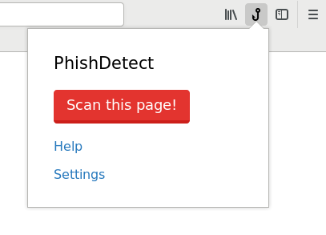
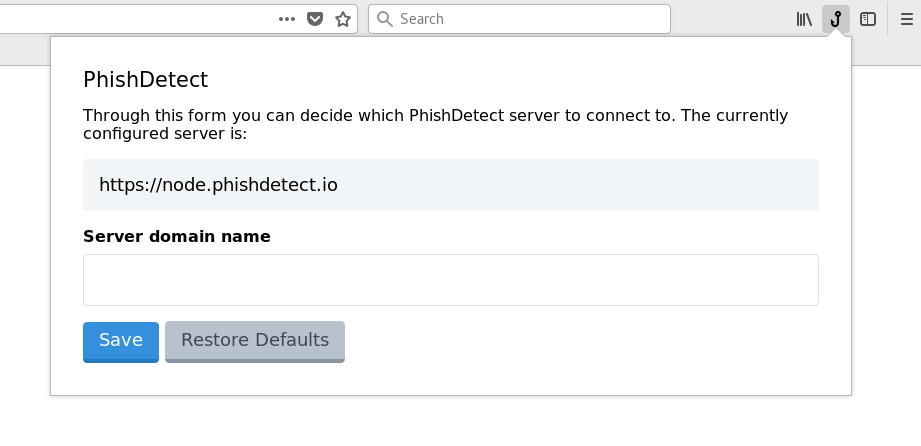

In order to use PhishDetect, the primary software you will need to install is the **PhishDetect Browser Extension**. This extension is available for Chrome and Mozilla Firefox browsers, and you can find the respective download links in the [Download](/download/) page.

Once you have installed the extension, you should notice a hook icon appearing in your browser's toolbar which is normally placed on the top-right of the browser's window, next to the address bar. By clicking on the hook button you will open a popup dialog like the following:

The first **Scan this page!** button will ask PhishDetect to scan the currently opened web page. The **Help** link will open a help page similar to this documentation. The **Settings** link will open an additional dialog that will look like the following:

The PhishDetect Browser Extension needs to be configured to communicate to what is called a **PhishDetect Node**. By default the extension is configured to communicate with a node located at **node.phishdetect.io**, which is operated by the creators of PhishDetect. However, through the Settings form you can change it to any other Node you prefer. For example, if you work for an organization that operates its own PhishDetect Node, you might have been provided with a PhishDetect Node address which you can enter through this form.

**That is all!** There is nothing else you need to do! You can proceed to the [How to Use](/docs/user/how-to-use/) guide.
