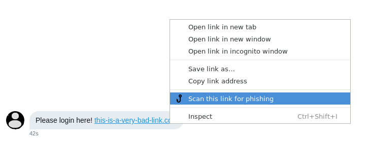
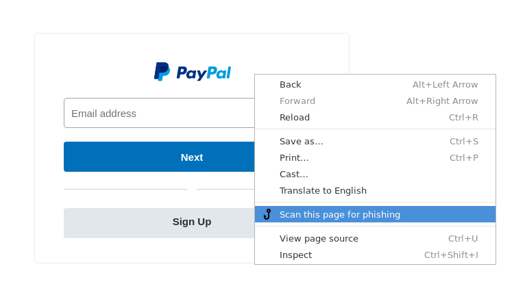

If you are suspicious of a webpage you have opened or a link you have received, you can ask the configured PhishDetect Node to scan scan them for phishing. A PhishDetect Node is a service that securely conducts the scanning of the suspicious link or page. Every newly installed brower extension comes pre-configured with a default PhishDetect Node located at node.phishdetect.io, which is operated by the creators of PhishDetect.

## Scanning links and pages

If you have received a link (for example through a private message or via social media) and you want to check it, you can right-click on the link and use the menu option "Scan this link for phishing":

If you already have open a page you are suspicious of, you can right-click on the page and use the "Scan this page for phishing" context menu option:

Alternatively, you can click on the hook button in the browser's toolbar and click on the "Scan this page" button:

These last two options have the advantage of analyzing the content of the webpage directly as it was rendered in your browser, therefore likely avoiding any potential anti-detection system the phishing kit might implement. These options are also normally a lot faster.

## Integration with Gmail

PhishDetect Browser Extension is able to integrate with Gmail's web interface. When you have PhishDetect Browser Extension installed and you click on a link contained inside the body of an email, instead of being taken directly to the link, you should be presented with the following dialog:

The ? button takes you this website.

By pressing the Directly red button, you are directed straight to the original link.

By pressing the Safely green button, you are directed to the configured PhishDetect Node, which will then analyze the link and try to determine whether there is anything suspicious with it.

## Analysis results

In the case you requested PhishDetect to perform the analysis of a link or of a page, you will be presented with a loading screen until the analysis is complete. The time necessary to complete an analysis depends on whether you requested the scan of a link or of a page and on the responsiveness of the target website. In any case it should only take a few seconds.

Once the analysis is completed, if nothing suspicious if found or if the page was even identified to be whitelisted (meaning it belongs to well-known online services such as Google, Facebook, Twitter, etc.) you will be presented with a temporary preview and you will then be automatically redirected to the original link after 30 seconds.

Instead, if any suspicious element is found, you will be presented with a preview of the page and a warning.

Please, always exercise caution. It is possible that some advanced phishing attacks are able to identify and bypass PhishDetect. If you have reasons to believe that a link that PhishDetect considered clean is in fact malicious, reach out to someone for assistance. If you suspect you've been a victim of a phishing attack, check out the [Have you been phished?](/docs/user/phished/) guide on this website. You might also find some answers to your questions in our [FAQ](/faq/). If you want to learn more about what data PhishDetect collects, refer to the [Privacy Policy](/docs/user/privacy/).
